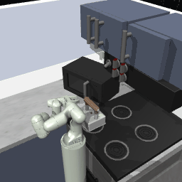

# EmbodiedGPT [[Paper](https://arxiv.org/pdf/2305.15021.pdf)] 


<!-- ## Description -->

Embodied AI is a crucial frontier in robotics, capable of planning and executing action sequences for robots to accomplish long-horizon tasks in physical environments. In this work, we introduce **EmbodiedGPT**, an end-to-end multi-modal foundation model for embodied AI, empowering embodied agents with multi-modal understanding and execution capabilities. To achieve this, we have made the following efforts: (i) We craft a large-scale embodied planning dataset, termed **EgoCOT**. The dataset consists of carefully selected videos from the Ego4D dataset, along with corresponding high-quality language instructions. Specifically, we generate a sequence of sub-goals with the "Chain of Thoughts" mode for effective embodied planning. (ii) We introduce an efficient training approach to EmbodiedGPT for high-quality plan generation, by adapting a 7B large language model (LLM) to the EgoCOT dataset via prefix tuning. (iii) We introduce a paradigm for extracting task-related features from LLM-generated planning queries to form a closed loop between high-level planning and low-level control. Extensive experiments show the effectiveness of EmbodiedGPT on embodied tasks, including embodied planning, embodied control, visual captioning, and visual question answering. Notably, EmbodiedGPT significantly enhances the success rate of the embodied control task by extracting more effective features. It has achieved a remarkable 1.6 times increase in success rate on the Franka Kitchen benchmark and a 1.3 times increase on the Meta-World benchmark, compared to the BLIP-2 baseline fine-tuned with the Ego4D dataset.

## 🤖💬 Online Demo

[**TODO**] EmbodiedGPT will be integrated into [InternGPT](https://github.com/OpenGVLab/InternGPT).

**InternGPT** is online (see [https://igpt.opengvlab.com](https://igpt.opengvlab.com/)). Let's try it!


## 🗓️ Schedule
- [ ] Release EgoCOT dataset
- [ ] Release EgoVQA dataset
- [ ] Release code and models

## 🏠 Overview


## 🎁 Major Features 


## Demos
### Demos in Franka Kitchen

|Open the cabinet|Turn the light on|Open the microwave oven|Slide the door open|
|----------------|----------------|----------------|----------------|
|  |  |  |  |

### Demos in Meta-World

|Assemble task|Place the bin|Hammer the nail |Open the drawer|
|----------------|----------------|----------------|----------------|
|  |  |  |  |

## 🎫 License

This project is released under the [Apache 2.0 license](LICENSE). 

## 🖊️ Citation

If you find this project useful in your research, please consider cite:

```BibTeX
@misc{2023embodiedgpt,
    title={EmbodiedGPT: Vision-Language Pre-Training via Embodied Chain of Thought},
    author={Yao Mu, Qinglong Zhang, Mengkang Hu, Wenhai Wang, Mingyu Ding, Jun Jin, Bin Wang, Jifeng Dai, Yu Qiao, Ping Luo},
    howpublished = {\url{https://arxiv.org/abs/2305.15021)},
    year={2023}
}
```
